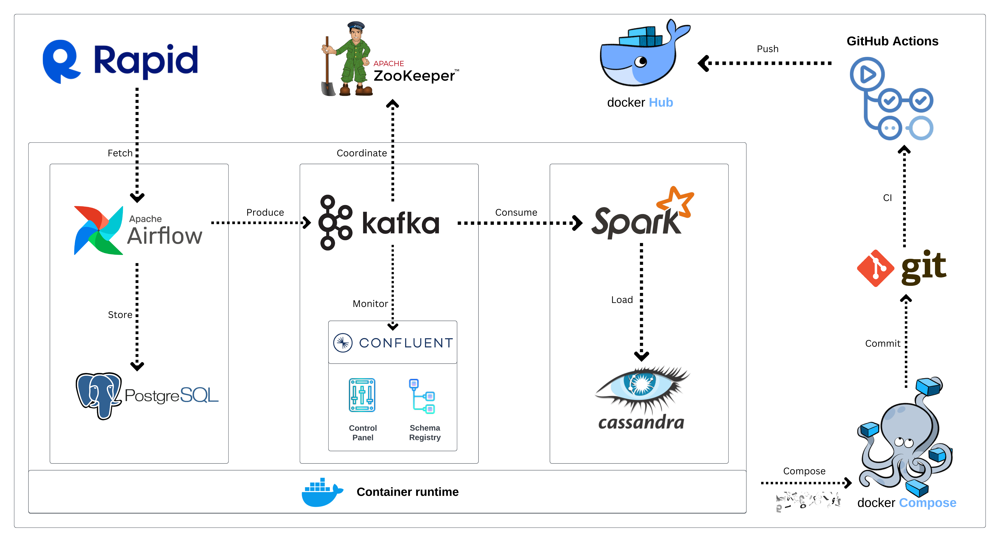

# Realtime Delta Lake Solution For Data Streaming

## Introduction

This project employs a multifaceted technological stack to establish an end-to-end data processing pipeline. The workflow commences by fetching data from the `randomuser.me` API to generate synthetic user data. This raw data is subsequently channeled through **Apache Airflow** for data orchestration and storage in a **PostgreSQL** database.

The data is then streamed through **Apache Kafka** in conjunction with **Apache Zookeeper** to facilitate real-time data movement from PostgreSQL to the processing engine. For streamlined management and monitoring of Kafka streams, **Control Center** and **Schema Registry** are employed to handle schema configurations and ensure effective oversight of the data streams.

Subsequently, **Apache Spark** is utilized to conduct data processing tasks, following which the processed data is persisted in a **Cassandra** database, providing a durable storage solution for the refined information.

The entire pipeline is encapsulated within **Docker** containers, affording a streamlined and portable deployment mechanism.

## System Architecture

## Technologies

- **Data Source**:  `randomuser.me` API is used to generate random user data for the pipeline.
- **Apache Airflow**: Helps with orchestrating the pipeline and storing fetched data in a PostgreSQL database.
- **Apache Kafka and Zookeeper**: Used for streaming data from PostgreSQL to the processing engine.
- **Control Center and Schema Registry**: Helps in monitoring and schema management of the Kafka streams.
- **Apache Spark**: Responsible for data processing with master and worker nodes.
- **Cassandra**: Database to store the processed data.
- **Docker**: Containerize the entire pipeline.

## Future Developments

The following are potential future developments to expand and improve the system architecture:

1. **Enhanced Monitoring with Confluent**
   Integrate advanced monitoring tools to better observe Kafka streaming and data flow, ensuring higher reliability and easier troubleshooting.

2. **Automated CI/CD Pipeline**
   Expand GitHub Actions to handle more comprehensive testing, deployments, and rollbacks, including setting up additional tests for data validation and integration within the pipeline.

3. **Schema Evolution Support**
   Improve support for schema evolution in the Kafka Schema Registry to manage changes in data structure without service disruption.

4. **Container Orchestration with Kubernetes**
   Move from Docker Compose to Kubernetes for improved container management, scaling, and resilience across the entire system architecture.

5. **Data Transformation with Spark**
   Introduce more transformation and enrichment capabilities in Spark, including real-time data cleansing and aggregation.

6. **Advanced Workflow Orchestration with Apache Airflow**
   Add more complex workflows, conditional paths, and event-based triggers in Airflow to handle dynamic and multi-step ETL processes.

7. **Automated Scaling of Apache Spark Clusters**
   Implement auto-scaling mechanisms for Spark clusters to dynamically adjust resources based on data load, reducing costs and improving efficiency.

8. **Integration of Additional Databases**
   Explore adding other databases, such as Elasticsearch for full-text search or a data lake for long-term storage and analysis.

9. **Enhanced Security and Access Control**
   Implement role-based access control (RBAC) and secure data encryption for data flowing through Kafka, Spark, and Cassandra.

10. **Real-time Alerting and Notifications**
    Set up alerting mechanisms for failures or anomalies detected in any component of the pipeline, providing real-time notifications through channels like Slack or email.

11. **Improved Data Visualization**
    Add a data visualization layer to enable end-users to analyze data insights and patterns directly within the pipeline.

12. **Use of Machine Learning Models**
    Integrate machine learning models directly into the streaming data pipeline for real-time analytics, predictions, and anomaly detection.

These additions will enhance the functionality, scalability, security, and usability of the system.

